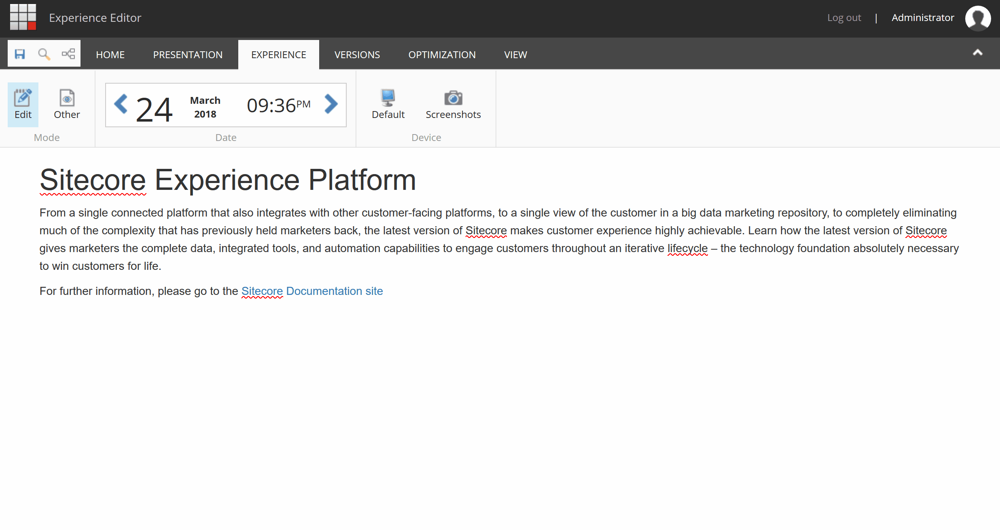
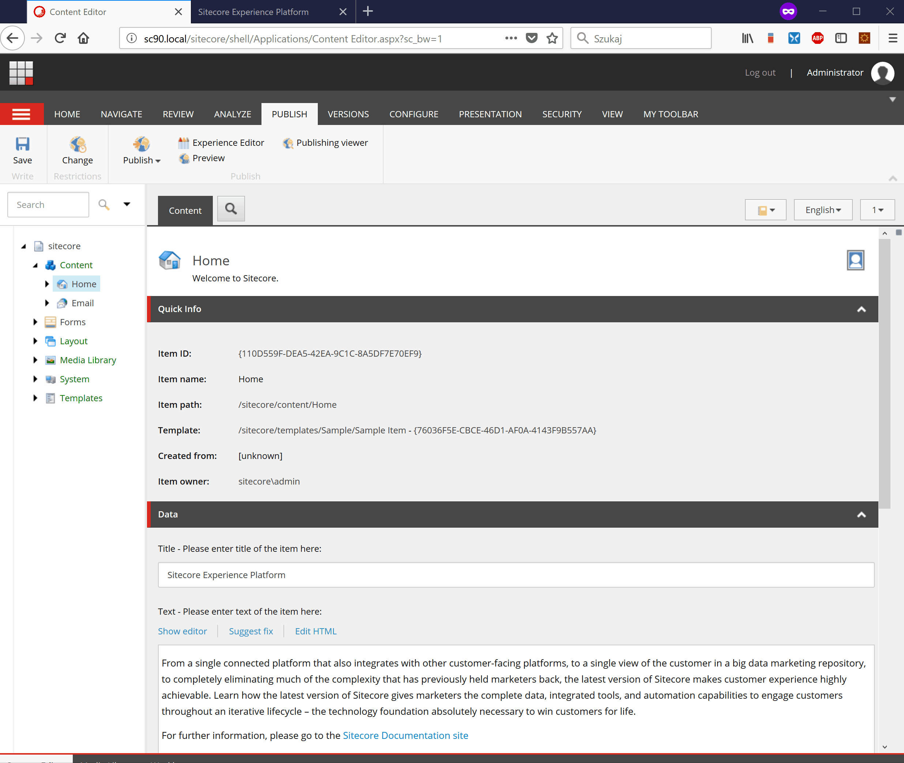

# SmartSitecore.InlineForms

Module allows to use Sitecore 9 Forms directly in Rich Text Field.

Editors have two options to insert the form:

* **Type in [form id="form-itemid"] tag:**

*You can find your form item IDs in Content Editor under /sitecore/Forms item*

* **Pick a form from Rich Text Editor:**

## Installation

* In Content Management or Standalone server install [Inline Foms-1.0 CM.zip](sc.package) using Sitecore Installation Wizard.
* In Content Delivery server copy the files from [Inline Foms-1.0 CD.zip](sc.package) to website root folder
